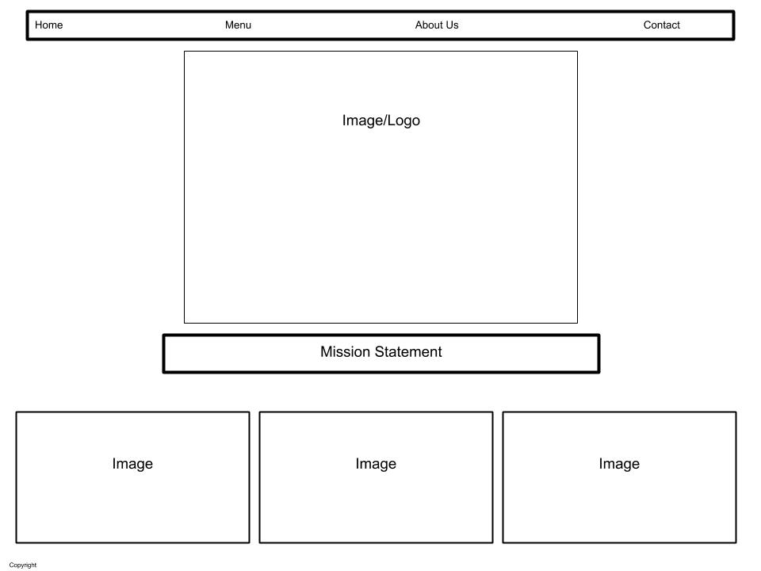

### Wednesday, April 29th   

**Structure Web Pages with HTML**

There are several things to consider before beginning to build out a webpage.  Before anything else, you must have in mind what it is that you *want* to build!  That means considering the following:

* Who are you building the site for?
* What is the purpose of the site as far as they are concerned?
* Who are they hoping will interact with the site?
* How will those users interact with the site?
* How often will they interact with the site?

Questions like this can ensure that all parties involved are on the same page before diving into the nitty gritty of web design.

Once we think we know these answers, it's time to build out a wireframe.  A wireframe is at it's core a bare bones representation of what kinds of information will be on the website and how that information will be organized.  We're not talking fonts and color swatches yet - we're not even talking content so much as broad categories sorted into a diagram that represents the skeleton or *wireframe* of the website that will be.

While building the wireframe it can be helpful to start thinking about design elements that will help to bring the overall concept of the website together, such as what information may need to pop - that's where you'll want to implement a thoughtful use of font size, color and style to bring your vision to life.

---

#### Now, on to the nitty gritty of building out your code!

A core tenant of coding in HTML is understanding how to use tags.  As described by Jon Duckett, 
> "Tags act like containers.  They Tell you something about the information that lies between their opeining and closing tags."

Therefore to build your website successfully you need to understand how to use tags to organize and customize your content.  Below are some of the basic HTML tags we use to get started:

|Tag|Description|
|:-:|--:|
|`<html></html>`|Indicates that the content is HTML code|
|`<head></head>`|Indicates that the contents contain information *about* the page but will not be shown inside the browser|
|`<title></title>`|Indicates that the contents are the *title* of the page, which will be shown above the URL.  This tag belongs inside the `<head></head>` tags
|`<body></body>`|Indicates that the contents should be shown inside the main browser|
|`<h1></h1>`|Indicates that the contents are a main heading.  H2 - H6 can be used in a similar way for subheadings|
|`

`|Indicates that the contents are a paragraph|
|`

`|Indicates that the contents are all related - this is broad category, and sometimes can be replaced by a more specific tag|

With the introduction of HTML5, many new tags were added to further organize internal content of webpages, such as `<header></header>` & `<footer></footer>` (more or less self explanitory, though it's interesting to note that these can indicate the header/footer for the webpage OR just for a section of that page) and `<nav></nav>` to indicate the navigation bar - a staple of most websites that allows for easy navigation of the various pages available.

Along with tags, you as a web designer can utilize attributes such as id and class - these are ways of adding additional information to tags so that later when it comes time to style your page you have a lot more control around what you're doing.  Until we dive into CSS this won't make as much sense, but for now just remember that the pricipal difference between the two is that

* an ID is unique!
* a class can be shared and applied many times throughout your project.

But more on that later...

[Home](https://jchinzi.github.io/learning-journal/)